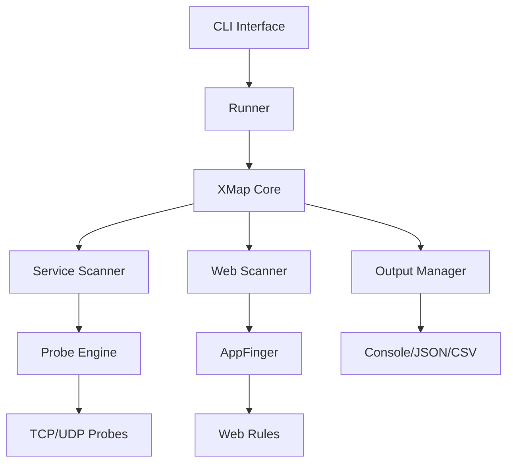

<div align="center">

# 🗺️ XMap

**高性能网络服务指纹识别工具**

*快速、准确、美观的网络服务发现和指纹识别*

[](https://golang.org/)
[](https://github.com/tongchengbin/xmap/releases)
[](LICENSE)
[](https://github.com/tongchengbin/xmap/actions)

[🇨🇳 中文](README.md) • [🇺🇸 English](README_EN.md) • [📖 文档](https://github.com/tongchengbin/xmap/wiki) • [🚀 快速开始](#-快速开始)

---

</div>

## 📖 简介

XMap 是一个现代化的网络服务指纹识别工具，专为安全研究人员和渗透测试人员设计。它结合了高性能的扫描引擎和智能的指纹识别技术，能够快速准确地识别网络服务、Web应用和技术栈。

### ✨ 为什么选择 XMap？

- 🚀 **极致性能** - 优化的并发扫描引擎，支持大规模网络探测
- 🎨 **美观输出** - 现代化的彩色终端输出，信息一目了然  
- 🔍 **精准识别** - 集成多种指纹库，识别准确率高
- 🛠️ **易于使用** - 简洁的命令行界面，支持多种输出格式
- 🔧 **高度可定制** - 灵活的配置选项，满足不同场景需求

## 🌟 核心特性

### 🔥 扫描能力
- **多协议支持** - TCP/UDP 服务探测和识别
- **Web指纹识别** - 集成 appfinger，识别 Web 应用和技术栈
- **智能探测** - 自适应探测策略，提高识别准确率
- **并发扫描** - 高效的工作池实现，支持大规模并发

### 🎨 用户体验  
- **彩色输出** - 状态码智能着色，组件信息层次分明
- **实时反馈** - 扫描进度实时显示，响应时间精确到微秒
- **多种格式** - 支持 Console、JSON、CSV 等输出格式
- **详细信息** - 显示服务版本、响应大小、耗时等详细信息

### ⚡ 性能优化
- **共享指纹库** - 多任务共享，减少内存占用
- **智能缓存** - 指纹匹配结果缓存，提升重复扫描速度  
- **资源控制** - 精确的超时和并发控制
- **内存优化** - 优化的数据结构，降低内存使用

## 🚀 快速开始

### 📦 安装方式

<details>
<summary><b>🎯 方式1: 使用 go install (推荐)</b></summary>

```bash
# 安装最新版本
go install github.com/tongchengbin/xmap@latest

# 安装指定版本
go install github.com/tongchengbin/xmap@v0.1.0
```

</details>

<details>
<summary><b>📥 方式2: 下载预编译二进制文件</b></summary>

访问 [Releases 页面](https://github.com/tongchengbin/xmap/releases) 下载适合你系统的版本：

**Linux:**
```bash
# AMD64
wget https://github.com/tongchengbin/xmap/releases/latest/download/xmap-linux-amd64.tar.gz
tar -xzf xmap-linux-amd64.tar.gz
sudo mv xmap-linux-amd64 /usr/local/bin/xmap

# ARM64  
wget https://github.com/tongchengbin/xmap/releases/latest/download/xmap-linux-arm64.tar.gz
tar -xzf xmap-linux-arm64.tar.gz
sudo mv xmap-linux-arm64 /usr/local/bin/xmap
```

**macOS:**
```bash
# Intel Mac
wget https://github.com/tongchengbin/xmap/releases/latest/download/xmap-darwin-amd64.tar.gz
tar -xzf xmap-darwin-amd64.tar.gz
sudo mv xmap-darwin-amd64 /usr/local/bin/xmap

# Apple Silicon Mac
wget https://github.com/tongchengbin/xmap/releases/latest/download/xmap-darwin-arm64.tar.gz
tar -xzf xmap-darwin-arm64.tar.gz
sudo mv xmap-darwin-arm64 /usr/local/bin/xmap
```

**Windows:**
```powershell
# 下载并解压到 PATH 目录
# https://github.com/tongchengbin/xmap/releases/latest/download/xmap-windows-amd64.zip
```

</details>

<details>
<summary><b>🔨 方式3: 从源码编译</b></summary>

```bash
# 克隆仓库
git clone https://github.com/tongchengbin/xmap.git
cd xmap

# 安装依赖
go mod download

# 编译
go build -ldflags="-s -w" -o xmap .

# 验证安装
./xmap -version
```

</details>

<details>
<summary><b>🐳 方式4: 使用 Docker</b></summary>

```bash
# 拉取镜像
docker pull tongchengbin/xmap:latest

# 运行
docker run --rm tongchengbin/xmap:latest -h

# 扫描示例
docker run --rm tongchengbin/xmap:latest -t example.com
```

</details>

### 💡 基本用法

#### 🎯 快速扫描

```bash
# 扫描单个目标
xmap -t example.com

# 扫描 HTTPS 服务
xmap -t https://example.com

# 扫描多个目标
xmap -t example.com,google.com,github.com

# 从文件读取目标列表
xmap -l targets.txt
```

#### 🔧 高级选项

```bash
# 指定端口范围
xmap -t 192.168.1.1 -p 80,443,8080-8090

# 设置并发数和超时
xmap -t 192.168.1.1 -c 50 -timeout 10

# 使用代理
xmap -t example.com -proxy http://127.0.0.1:8080

# 显示详细响应信息
xmap -t example.com --debug-resp

# 静默模式（仅输出结果）
xmap -t example.com -silent
```

#### 📄 输出格式

```bash
# JSON 格式输出
xmap -t example.com -ot json

# 保存到文件
xmap -t example.com -o results.json -ot json

# CSV 格式
xmap -t example.com -ot csv -o results.csv

# 更新指纹规则库
xmap -ur
```

### 🎨 输出示例

XMap 提供美观的彩色输出，让扫描结果一目了然：

```
https://example.com WebPanel │ ADGuard │ PHP/7.2.30 [Login | Control WebPanel] [200 OK] [1.85KB] [2.30s]
```

**输出字段说明：**
- 🌐 **URL** - 目标地址（亮绿色）
- 🔧 **组件** - 识别的技术栈，版本号高亮显示
- 📄 **标题** - 页面标题（白色加粗）  
- 📊 **状态码** - HTTP状态码，智能着色（2xx绿色，4xx红色等）
- 📏 **大小** - 响应体大小，自动转换单位
- ⏱️ **耗时** - 扫描耗时，精确到微秒

## 🔧 编程接口

XMap 提供简洁易用的 Go API，方便集成到你的项目中：

<details>
<summary><b>📝 基础用法示例</b></summary>

```go
package main

import (
	"context"
	"fmt"
	"log"

	"github.com/tongchengbin/xmap/pkg/api"
	"github.com/tongchengbin/xmap/pkg/types"
)

func main() {
	// 创建 XMap 实例
	options := types.DefaultOptions()
	options.Threads = 50
	options.Timeout = 10
	
	xmap, err := api.New(options)
	if err != nil {
		log.Fatal(err)
	}

	// 创建扫描目标
	target := &types.ScanTarget{
		Host:     "example.com",
		Port:     443,
		Protocol: "tcp",
		Scheme:   "https",
	}

	// 执行扫描
	ctx := context.Background()
	result, err := xmap.Scan(ctx, target)
	if err != nil {
		log.Printf("扫描失败: %v", err)
		return
	}

	// 输出结果
	fmt.Printf("服务: %s\n", result.Service)
	fmt.Printf("URL: %s\n", result.URL)
	
	// 显示组件信息
	for _, component := range result.Components {
		if name, ok := component["name"]; ok {
			fmt.Printf("组件: %v", name)
			if version, ok := component["version"]; ok {
				fmt.Printf(" 版本: %v", version)
			}
			fmt.Println()
		}
	}
}
```

</details>

<details>
<summary><b>🚀 批量扫描示例</b></summary>

```go
package main

import (
	"context"
	"fmt"
	"log"

	"github.com/tongchengbin/xmap/pkg/api"
	"github.com/tongchengbin/xmap/pkg/input"
	"github.com/tongchengbin/xmap/pkg/types"
)

func main() {
	// 创建 XMap 实例
	options := types.DefaultOptions()
	options.Threads = 100
	
	xmap, err := api.New(options)
	if err != nil {
		log.Fatal(err)
	}

	// 创建输入提供者
	targets := []string{
		"https://example.com",
		"https://google.com", 
		"https://github.com",
	}
	
	provider := input.NewSliceProvider(targets)

	// 批量扫描
	ctx := context.Background()
	err = xmap.ScanWithCallback(ctx, provider, func(result *types.ScanResult) {
		if result.Error != nil {
			fmt.Printf("❌ %s: %v\n", result.Target.Host, result.Error)
			return
		}
		
		fmt.Printf("✅ %s - %s\n", result.URL, result.Service)
		
		// 显示识别的组件
		for _, comp := range result.Components {
			if name, ok := comp["name"]; ok {
				fmt.Printf("   🔧 %v", name)
				if ver, ok := comp["version"]; ok {
					fmt.Printf("/%v", ver)
				}
				fmt.Println()
			}
		}
	})
	
	if err != nil {
		log.Fatal(err)
	}
}
```

</details>

## 🏗️ 架构设计

XMap 采用现代化的模块化架构，确保高性能和可扩展性：



### 🔧 核心组件

| 组件 | 功能 | 特点 |
|------|------|------|
| **🎯 Scanner Engine** | 核心扫描引擎 | 支持TCP/UDP协议，智能探测 |
| **🌐 Web Scanner** | Web应用扫描 | 集成appfinger，识别技术栈 |
| **📚 Probe Manager** | 探针管理 | 单例模式，共享指纹库 |
| **⚡ Worker Pool** | 并发控制 | 动态调整，资源优化 |
| **📊 Output Manager** | 结果输出 | 多格式支持，美观展示 |

### 🚀 性能优化

- **内存共享**: 多任务共享指纹库，减少内存占用
- **智能缓存**: 探测结果缓存，提升重复扫描速度
- **并发控制**: 精确的工作池管理，避免资源浪费
- **异步处理**: 非阻塞I/O，提高扫描效率

## � 项目结构

```
📦 xmap/
├── 🎯 main.go                   # 程序入口
├── 📂 pkg/                      # 核心包
│   ├── 🔌 api/                  # 对外API接口
│   ├── 🎮 runner/               # 命令行运行器
│   ├── 🔍 scanner/              # 服务扫描引擎
│   ├── 🌐 web/                  # Web应用扫描
│   ├── 🧪 probe/                # 探针和指纹库
│   ├── 📊 output/               # 结果输出管理
│   ├── 📥 input/                # 输入处理
│   ├── 🏷️ types/                # 数据类型定义
│   └── 🛠️ utils/                # 工具函数
├── 🐳 Dockerfile               # Docker构建文件
├── 🔄 .github/workflows/       # CI/CD配置
├── 📚 examples/                # 使用示例
├── 🧪 tests/                   # 测试代码
└── 📖 README.md                # 项目文档
```

## ⚙️ 配置选项

### 🎯 扫描配置

| 参数 | 说明 | 默认值 | 示例 |
|------|------|--------|------|
| `-t, --target` | 扫描目标 | - | `example.com` |
| `-l, --list` | 目标文件 | - | `targets.txt` |
| `-p, --port` | 端口范围 | 常用端口 | `80,443,8080-8090` |
| `-c, --concurrency` | 并发数 | `50` | `100` |
| `--timeout` | 超时时间(秒) | `10` | `30` |
| `--retries` | 重试次数 | `1` | `3` |

### 📊 输出配置

| 参数 | 说明 | 默认值 | 示例 |
|------|------|--------|------|
| `-o, --output` | 输出文件 | - | `results.json` |
| `-ot, --output-type` | 输出格式 | `console` | `json,csv` |
| `-silent` | 静默模式 | `false` | - |
| `--debug-resp` | 显示响应详情 | `false` | - |

### 🌐 网络配置

| 参数 | 说明 | 默认值 | 示例 |
|------|------|--------|------|
| `--proxy` | 代理服务器 | - | `http://127.0.0.1:8080` |
| `--user-agent` | User-Agent | `xmap/v0.1.0` | `Custom-Agent` |
| `--disable-icon` | 禁用图标获取 | `false` | - |

## 🆚 与其他工具对比

| 特性 | XMap | Nmap | Masscan | Nuclei |
|------|------|------|---------|--------|
| 🚀 **扫描速度** | ⭐⭐⭐⭐⭐ | ⭐⭐⭐ | ⭐⭐⭐⭐⭐ | ⭐⭐⭐ |
| 🎯 **指纹识别** | ⭐⭐⭐⭐⭐ | ⭐⭐⭐⭐ | ⭐⭐ | ⭐⭐⭐⭐⭐ |
| 🌐 **Web扫描** | ⭐⭐⭐⭐⭐ | ⭐⭐ | ⭐ | ⭐⭐⭐⭐ |
| 🎨 **输出美观** | ⭐⭐⭐⭐⭐ | ⭐⭐ | ⭐⭐ | ⭐⭐⭐⭐⭐ |
| 🔧 **易用性** | ⭐⭐⭐⭐⭐ | ⭐⭐⭐ | ⭐⭐⭐ | ⭐⭐⭐⭐ |
| 📊 **API支持** | ⭐⭐⭐⭐⭐ | ⭐⭐ | ⭐ | ⭐⭐⭐ |

### 🎯 XMap 的优势

- **🚀 现代化设计** - 基于Go语言，性能优异，内存占用低
- **🎨 美观输出** - 彩色终端输出，信息层次分明
- **🌐 Web专长** - 集成appfinger，Web应用识别能力强
- **🔧 简单易用** - 命令行简洁，API友好
- **📊 实时反馈** - 扫描进度和详细信息实时显示

## 📚 相关资源

### 📖 文档
- [📘 使用指南](https://github.com/tongchengbin/xmap/wiki)
- [🔧 API文档](https://pkg.go.dev/github.com/tongchengbin/xmap)
- [❓ 常见问题](https://github.com/tongchengbin/xmap/wiki/FAQ)

### 🛠️ 相关项目
- [🔍 finger-rules](https://github.com/tongchengbin/finger-rules) - 服务指纹规则库
- [🌐 appfinger](https://github.com/tongchengbin/appfinger) - Web应用指纹识别
- [📊 nuclei](https://github.com/projectdiscovery/nuclei) - 漏洞扫描器

## 🤝 参与贡献

我们欢迎各种形式的贡献！

### 🎯 贡献方式
- 🐛 **报告Bug** - [提交Issue](https://github.com/tongchengbin/xmap/issues/new)
- 💡 **功能建议** - [功能请求](https://github.com/tongchengbin/xmap/issues/new)
- 📝 **改进文档** - 提交PR改进文档
- 🔧 **代码贡献** - Fork项目并提交PR

### 📋 开发指南
```bash
# 1. Fork 项目
# 2. 克隆到本地
git clone https://github.com/your-username/xmap.git
cd xmap

# 3. 创建功能分支
git checkout -b feature/your-feature

# 4. 提交更改
git commit -am 'Add some feature'

# 5. 推送分支
git push origin feature/your-feature

# 6. 创建 Pull Request
```

## 📄 许可证

本项目采用 [MIT 许可证](LICENSE) - 详见 LICENSE 文件

## 🙏 致谢

感谢以下开源项目和贡献者：

- [🔍 ProjectDiscovery](https://github.com/projectdiscovery) - 提供优秀的安全工具生态
- [🌐 appfinger](https://github.com/tongchengbin/appfinger) - Web应用指纹识别
- [📊 goflags](https://github.com/projectdiscovery/goflags) - 命令行参数解析
- [📝 gologger](https://github.com/projectdiscovery/gologger) - 日志记录功能

---

<div align="center">

**⭐ 如果这个项目对你有帮助，请给个Star支持一下！**

[🏠 主页](https://github.com/tongchengbin/xmap) • [📖 文档](https://github.com/tongchengbin/xmap/wiki) • [🐛 反馈](https://github.com/tongchengbin/xmap/issues) • [💬 讨论](https://github.com/tongchengbin/xmap/discussions)

</div>


